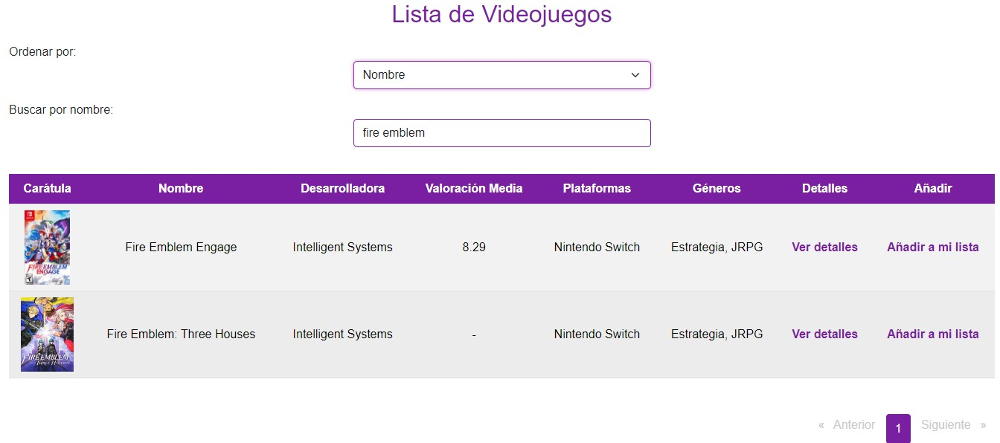
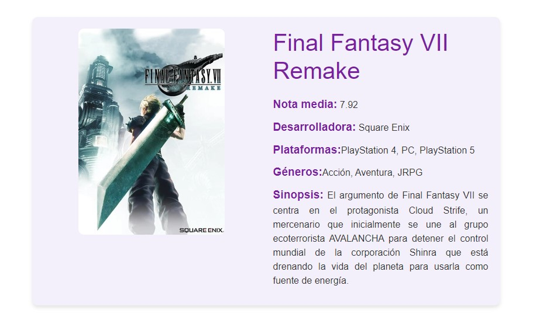
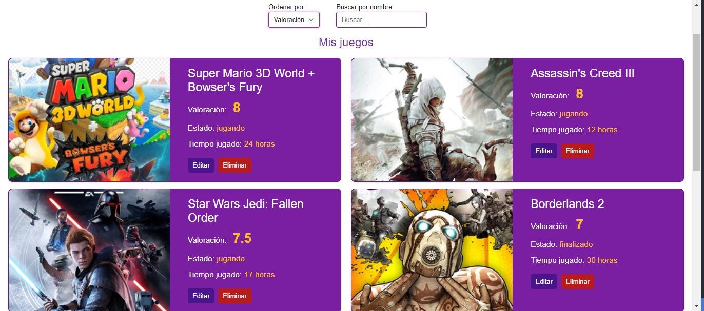

# My Videogame List 

  

  

 

---

My Videogame List is a web application dedicated to video games and gamers. It features a large database of video games from all current genres and platforms. 
You can create your own list of video games and organize them to keep track of them. Add both the games you've already played and rate them if you wish, as well as add those you have pending, are currently playing, or want to buy but don't yet have.

Once registered, you will see a large list of video games from all current genres and platforms.

## Versions
---
This project was developed with:

- PHP 8.1
- Symfony 5.8
- Angular 16
- Node 10
- Npm 6
- Composer 2.7.7

It may be necessary to use these or later versions for proper functionality in some cases.

## Prerequisites
---
Before starting, make sure you have installed:

- Docker
- Node
- Npm
- Composer

## Installation and Deployment Guide
---
1. Clone the repository to your local machine.

2. Frontend folder: `npm install`

3. Backend folder: copy `.env.dist` to the root directory, rename it to `.env`, and change all necessary data for your application.
   
4. For JWT tokens:
   - Generate a private key and a public key with OpenSSL. Place them in the desired path (I suggest creating a `JWT` folder inside `Backend/Config` and placing them there).
   - Set the correct path to your keys in the `.env`.
   - If you encounter permission issues, set the following:
     - `chown www-data:www-data /var/www/config/jwt/private.pem`
     - `chown www-data:www-data /var/www/config/jwt/public.pem`

5. Once the `.env` is configured, run `composer install` in the backend folder.

6. The docker-compose files have environment variables to add the data as needed, so you need to:
  - Backend folder: create the `.env.docker` file and set the variables you want.
  - Frontend folder: create the `.env` file and set the variables you want.

7. Start the backend container: `docker compose --env-file .env.docker up -d`.

8. Before starting the frontend container, we need to modify the endpoints of the created services (frontend/src/app/shared/services). We have to replace the existing one with the IP of our backend or with localhost (the latter is commented out). 

9. Start the frontend container: `sudo docker compose up -d`.

10. The project includes a database. Use the dockerized PHPMyAdmin to open it at `http://yourIP:yourPort` as specified in the `.env.docker` to log into PHPMyAdmin. Once inside, you can import the database provided by the project.
This database includes games, genres, platforms, and test users. You can delete them if you wish.

1.  Finally, to create an admin who can manage the admin panel, you can do it in two ways:
- From PHPMyAdmin with ["ROLE_ADMIN"]
- Uncomment the method found in `Backend/src/Controllers/UserController.php` called `/user/create-admin` and specify the username and password you want.
Once done, navigate to: `http://yourIP:yourPort/user/create-admin`.

The admin will be created with the specified data. Once created, comment out this method in `UserController.php` so it is no longer accessible.

# Application Usage

### General Videogame List
---
In the game list, you can sort by Name, Developer, or Average Rating. In the latter case, the application takes the average rating given by all users of the application so they can see the highest-rated games by the community.

You can also search by game name:

### More Information About the Videogame
---
Select the "view details" option to get more information about the specific game.

### Add Videogame to Your List
---
Choose the "add to my list" option and a form will appear to fill out and add it.

### Your Own Videogame List
---
In the "My Videogame List" option, you can see the games you have added to your list. You can sort and filter according to various criteria.

### Remove Videogame from Your List
---
Simply select the delete option that appears on each of the games in your list.

### Edit Videogame in Your List
---
A form will open where you can change what you want and update it in your list.

## Admin Panel
---
If you log in as an admin, you will see a different page. The game list still appears, but now you can add, edit, and delete games from the database, as well as add or delete genres and platforms.

You just need to fill out the various forms as needed.

## Other Languages

- [Español (Spanish)](README_es.md)