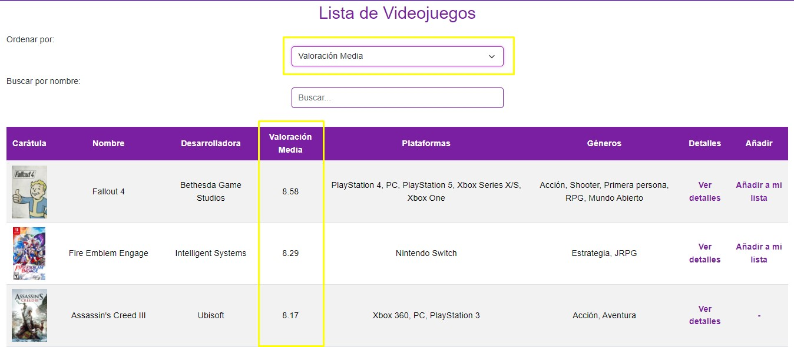
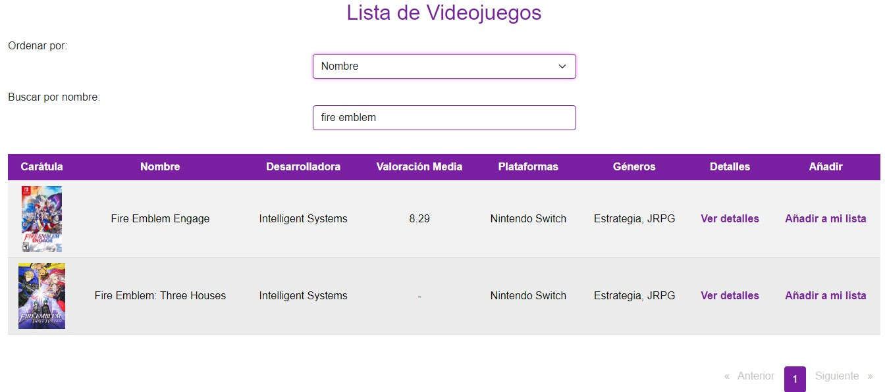
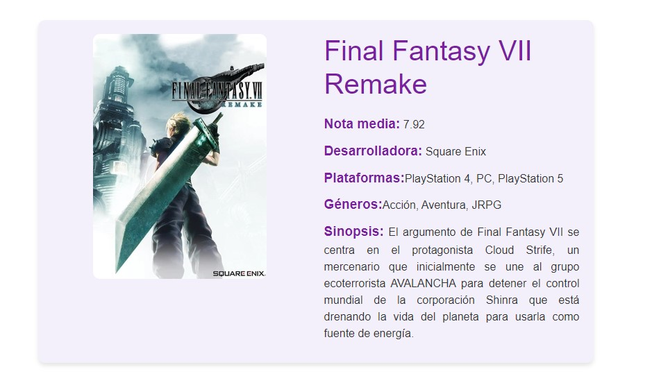
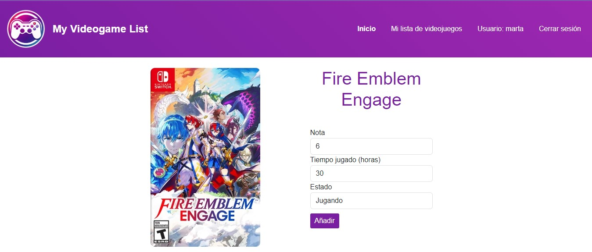
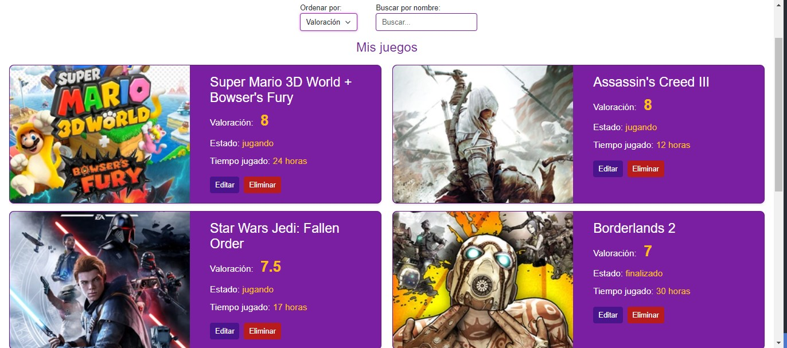
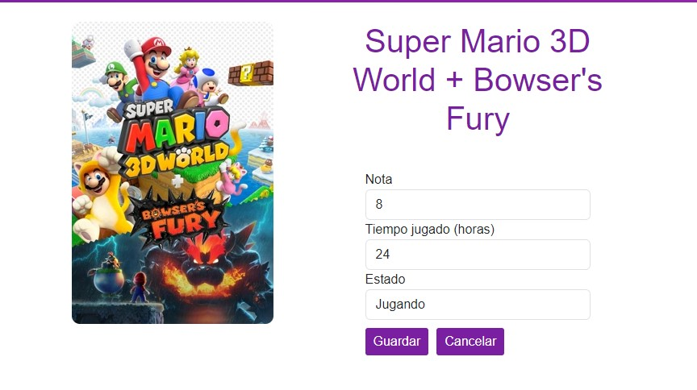

# My Videogame List 

  

  

 

---

My Videogame List es una aplicación web destinada a los videojuegos y a los jugadores. Contando con una amplia base de datos de videojuegos de todos los géneros y plataformas actuales.
Podrás crear tu propia lista de videojuegos y organizarlos para llevar un control sobre los mismos. Añadir tanto los juegos que ya has jugado y darles una nota si lo deseas, como agregar aquellos que tienes pendientes, que estás jugando actualmente o que deseas comprar pero aún no tienes.

Una vez registrado, podrás ver una amplia lista de videojuegos de todos los géneros y plataformas actuales.

## Versiones
---
Este proyecto se ha realizado con:

- PHP 8.1
- Symfony 5.8
- Angular 16
- Node 10
- Npm 6
- Composer 2.7.7

Puede ser necesario el uso de dichas versiones o posteriores para su correcto funcionamiento en algunos casos.

## Requisitos previos
---
Antes de empezar, es necesario tener instalados:

- Docker
- Node
- Npm
- Composer

## Guía de instalación y despliegue
---
1. Clonamos el repositorio en nuestra máquina local.

2. Carpeta frontend: `npm install`

3. Carpeta backend: copiamos el `.env.dist` en la raíz del directorio, lo renombramos a `.env` y cambiamos todos los datos necesarios por los que vayamos a poner en nuestra aplicación.
   
4. Para los token JWT:
   - Generamos con OpenSSL una llave privada y una pública. La ponemos en la ruta que deseemos (aconsejo crear carpeta JWT dentro de `Backend/Config` y colocarlas ahí).
   - Colocamos en el `.env` la ruta correcta a nuestras llaves.
   - En caso de fallo de permisos, dar los siguientes:
     - `chown www-data:www-data /var/www/config/jwt/private.pem`
     - `chown www-data:www-data /var/www/config/jwt/public.pem`

5. Una vez configurado el `.env`, lanzamos `composer install` en la carpeta de backend.

6. Los `docker-compose` poseen variables de entorno para añadir los datos según queramos, por lo tanto hay que:
  - Carpeta backend: creamos el archivo `.env.docker` y colocamos las variables que deseemos.
  - Carpeta frontend: creamos el archivo `.env` y colocamos las variables que deseemos.

7. Arrancamos contenedor del backend: `docker compose --env-file .env.docker up -d`.

8. Antes de arrancar el contenedor del frontend. Tenemos que modificar los endpoints de los services creados (frontend/src/app/shared/services). Hay que sustituir el que aparece por la IP de nuestro backend o por localhost (este último viene comentado).  

9. Arrancamos contenedor del frontend: `sudo docker compose up -d`.

10. El proyecto trae una BD. Usamos el PHPMyAdmin que tenemos dockerizado para abrirla en `http://yourIP:yourPort` indicamos en el `.env.docker` para entrar al PHPMyAdmin. Una vez dentro, podemos importar la BD que trae el proyecto.
Dicha BD, además de los juegos, géneros y plataformas, trae usuarios de prueba. Podemos borrarlos si lo deseamos.

1.  Por último, para crear un administrador que pueda manejar el panel de administración, podemos hacerlo de dos formas:
- Desde PHPMyAdmin con `["ROLE_ADMIN"]`
- Descomentando el método que encontramos en `Backend/src/Controllers/UserController.php` llamado `/user/create-admin` e indicamos el username y contraseña que deseemos.
Una vez hecho, introducimos en el navegador: `http://yourIP:yourPort/user/create-admin`.

Se nos creará el administrador con los datos indicados en el método. Una vez creado, volvemos a comentar dicho método en `UserController.php` para que no sea accesible.

# Uso de la aplicación

### Lista general de videojuegos
---
En la lista de juegos, podrás ordenarlos por Nombre, Desarrolladora o Valoración Media. En este último caso, la aplicación coge la nota media según las calificaciones dadas por todos los usuarios de la aplicación, para que así puedan saber los juegos mejor valorados de la comunidad.

También podrás buscar por nombre del juego:

### Más información sobre el videojuego
---
Selecciona la opción "ver detalles" para obtener más información sobre dicho videojuego concreto

### Añadir videojuego a tu lista
---
Se elige la opción "añadir a mi lista" y aparecerá un formulario que rellenar para añadirlo.

### Tu propia lista de videojuegos
---
En la opción "Mi lista de videojuegos" podrás ver aquellos juegos que tienes añadidos a tu lista. Podrás ordenar y filtrar según diversos criterios.

### Eliminar videojuego de tu lista
---
Simplemente selecciona la opción de eliminar que aparece en cada uno de los juegos de tu lista.

### Editar videojuego de tu lista
---
Se abrirá un formulario en el que podrás cambiar lo que desees y actualizarlo en tu lista.

## Panel de administración
---
Si nos logueamos como un administrador, veremos una página distinta. La lista de juegos sigue apareciendo, pero ahora podremos añadir, editar y eliminar juegos de la BD, además de añadir o eliminar géneros y plataformas.

Simplemente tenemos que rellenar los distintos formularios según sea el caso.

## Otros lenguajes

- [English (Inglés)](README.md)
